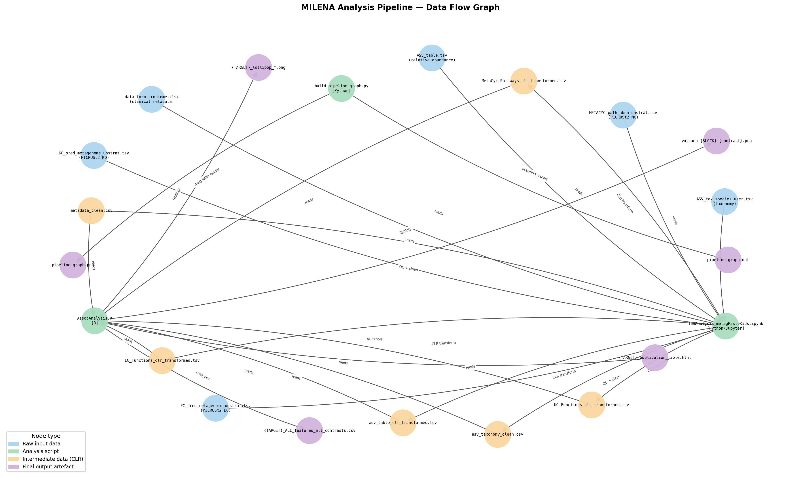

# MILENA — Microbiome of Children: Functional Analysis Pipeline

[](LICENSE)
[](https://doi.org/10.5281/zenodo.XXXXXXX)

**Author:** Dr. rer. nat. Guillermo G. Torres  
**Contact:** guigotoe@gmail.com  
**Repository:** https://github.com/cobinet/Microbiome_Children_Milena_Project

---

## Abstract

This repository provides the complete analysis pipeline for the MILENA project,
which investigates functional microbiome signatures in a pediatric pastoral cohort
(ages 6–59 months). The analysis links predicted functional profiles from 16S rRNA
amplicon data (PICRUSt2-predicted KEGG Orthology, Enzyme Commission numbers, and
MetaCyc pathways) to parasitic infection status:

- **BH** — *Blastocystis hominis*
- **GL** — *Giardia lamblia*
- **DF** — *Dientamoeba fragilis*

Infection groups are defined as **None** (uninfected), **Single** (target parasite only),
and **Coinfection** (target + at least one concurrent parasite). Multi-contrast
differential abundance analysis is performed using empirical Bayes moderated t-tests
(limma) on CLR-transformed data with Benjamini-Hochberg FDR correction.

---

## Repository Structure

```
.
├── scripts/
│   ├── AssocAnalysis.R                    # R: differential abundance analysis (limma)
│   └── funAnalysis_metagPastoKids.ipynb   # Python/Jupyter: preprocessing & QC pipeline
├── data/
│   └── README.md                          # Data specifications (files not included)
├── docs/
│   ├── graph/
│   │   ├── build_pipeline_graph.py        # Generates pipeline knowledge graph
│   │   ├── pipeline_graph.dot             # Graphviz DOT source
│   │   └── pipeline_graph.png             # Pipeline DAG figure
│   └── lightrag/
│       └── index_pipeline.py              # LightRAG script indexer (local RAG)
├── .github/
│   └── workflows/
│       └── lint.yml                       # CI: syntax validation on push
├── requirements.txt                       # Python dependencies
├── R_environment.txt                      # R package dependencies
├── CITATION.cff                           # Citation metadata
└── LICENSE                                # MIT License
```

---

## Pipeline Overview

```
Raw Data (not in repo)
    │
    ├── ASV_table.tsv ──────────────┐
    ├── ASV_tax_species.user.tsv    │
    ├── EC_pred_metagenome.tsv      ├──► funAnalysis_metagPastoKids.ipynb
    ├── KO_pred_metagenome.tsv      │    (Python/Jupyter)
    ├── METACYC_path_abun.tsv       │    • Sample QC & standardization
    └── data_formicrobiome.xlsx ────┘    • CLR transformation (pseudocount)
                                         • PERMANOVA / PCoA
                                         │
                              ┌──────────┘
                              ▼
                    CLR-transformed TSVs + cleaned metadata
                              │
                              ▼
                        AssocAnalysis.R  (R)
                        • Residualize vs Age/Sex (limma)
                        • Build infection outcome Y (None/Single/Coinfection)
                        • Multi-contrast eBayes per block (KO, EC, MetaCyc)
                        • BH-FDR correction, q ≤ 0.10
                              │
                    ┌─────────┼─────────┐
                    ▼         ▼         ▼
              HTML tables  Lollipop  Volcano
              (gt)         plots     plots
                           (ggplot2) (ggplot2)
```

The pipeline DAG is also available as a machine-readable figure:



---

## Prerequisites

### System requirements
- macOS / Linux (tested on macOS 14+ and Ubuntu 22.04)
- Python ≥ 3.10
- R ≥ 4.3
- 8 GB RAM minimum (16 GB recommended for large functional tables)

### Python environment
```bash
python3 -m venv .venv
source .venv/bin/activate        # Windows: .venv\Scripts\activate
pip install -r requirements.txt
```

### R environment
```r
# Install BiocManager if needed
install.packages("BiocManager")

# Install all R dependencies (see R_environment.txt for details)
source("R_environment.txt")
```

---

## Data Acquisition

Raw data are **not included** in this repository. See [`data/README.md`](data/README.md)
for full file specifications.

1. Obtain the raw 16S rRNA amplicon sequences (accession: _TBD upon publication_)
2. Process with **QIIME2** (≥ 2023.5) to obtain `ASV_table.tsv` and `ASV_tax_species.user.tsv`
3. Run **PICRUSt2** (≥ v2.5) to generate functional predictions:
   ```bash
   picrust2_pipeline.py -s asv_sequences.fna -i ASV_table.biom -o picrust2_output/ -p 4
   ```
4. Place all files in the `data/` directory as specified in `data/README.md`
5. Place clinical metadata in `data/data_formicrobiome.xlsx`

---

## Replication Steps

### Step 1 — Preprocessing and QC (Python/Jupyter)

Run the Jupyter notebook to clean data, normalize, and generate CLR-transformed matrices:

```bash
source .venv/bin/activate
cd scripts/
jupyter notebook funAnalysis_metagPastoKids.ipynb
```

Or execute non-interactively:
```bash
jupyter nbconvert --to notebook --execute \
  --output funAnalysis_metagPastoKids_executed.ipynb \
  scripts/funAnalysis_metagPastoKids.ipynb
```

**Expected outputs** (written to `data/microbiome_analysis_output/`):
- `preprocessing_output/asv_table_clr_transformed.tsv`
- `preprocessing_output/KO_Functions_clr_transformed.tsv`
- `preprocessing_output/EC_Functions_clr_transformed.tsv`
- `preprocessing_output/MetaCyc_Pathways_clr_transformed.tsv`
- `analysis_ready_data/metadata_clean.csv`
- `analysis_ready_data/asv_taxonomy_clean.csv`

### Step 2 — Differential Abundance Analysis (R)

Run the association analysis for all three target parasites (BH, GL, DF):

```bash
Rscript scripts/AssocAnalysis.R
```

**Expected outputs** (written to `data/microbiome_analysis_output/infectionsFunctions_result/`):
- `BH_ALL_features_all_contrasts.csv`
- `BH_publication_table.html`
- `BH_lollipop_BH_vs_None.png`
- `BH_lollipop_BH_vs_Coinf.png`
- _(equivalent files for GL and DF)_

### Step 3 — Regenerate Pipeline Knowledge Graph (optional)

```bash
source .venv/bin/activate
python docs/graph/build_pipeline_graph.py
```

### Step 4 — Run LightRAG Pipeline Indexer (optional)

Indexes all scripts into a local RAG knowledge base and exports a structured
pipeline outline to `docs/lightrag/pipeline_outline.md`:

```bash
source .venv/bin/activate
python docs/lightrag/index_pipeline.py
```

---

## Statistical Methods Summary

| Step | Method | Tool | Reference |
|---|---|---|---|
| Compositional normalization | Centered Log-Ratio (CLR) | custom Python | Aitchison (1986) |
| Zero handling | Quantile-bounded pseudocount | custom Python | — |
| Covariate residualization | Linear regression residuals | limma::lmFit | Ritchie et al. (2015) |
| Differential abundance | Empirical Bayes moderated t-test | limma::eBayes | Smyth (2004) |
| Multiple testing correction | Benjamini-Hochberg FDR | R base | Benjamini & Hochberg (1995) |
| Significance threshold | q ≤ 0.10, \|logFC\| > 0.15 | — | — |
| Multivariate analysis | PERMANOVA (999 permutations) | vegan::adonis2 | Anderson (2001) |
| Functional prediction | PICRUSt2 | PICRUSt2 v2.5 | Douglas et al. (2020) |

---

## Citation

If you use this code, please cite:

> Torres, G.G. (2025). *MILENA: Microbiome analysis pipeline for pediatric cohort
> studies*. GitHub. https://github.com/cobinet/Microbiome_Children_Milena_Project

See [`CITATION.cff`](CITATION.cff) for machine-readable citation metadata.

---

## License

MIT © 2025 Dr. rer. nat. Guillermo G. Torres — see [`LICENSE`](LICENSE).
